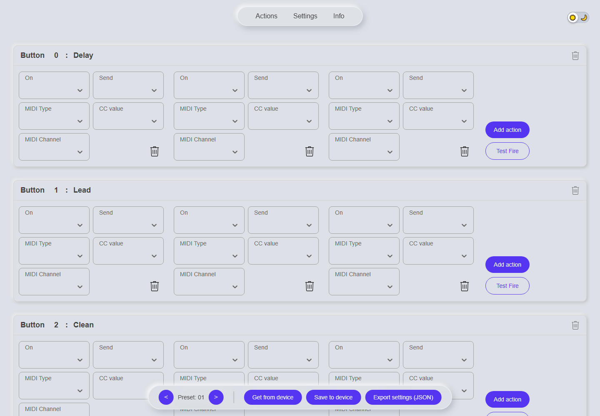

# MIDI Footswitch Controller — Web UI

A web-based configuration tool for a DIY MIDI foot controller. Assign each
footswitch its own sequence of MIDI actions — control change, program change,
note on/off, and more — right from the browser, then save the preset to the
device.



## Features

- Configure multiple MIDI actions per footswitch (add/remove/reorder)
- Add or remove footswitch panels, rename them, and assign custom button numbers
- Light and dark theme, following system preference by default
- Export the full configuration as JSON

## Getting started

```bash
npm install
npm run dev
```

Then open the printed local URL and navigate to the **Actions** page to start
configuring footswitches.

## Tech stack

Built with [React](https://react.dev/) and [Vite](https://vitejs.dev/).
